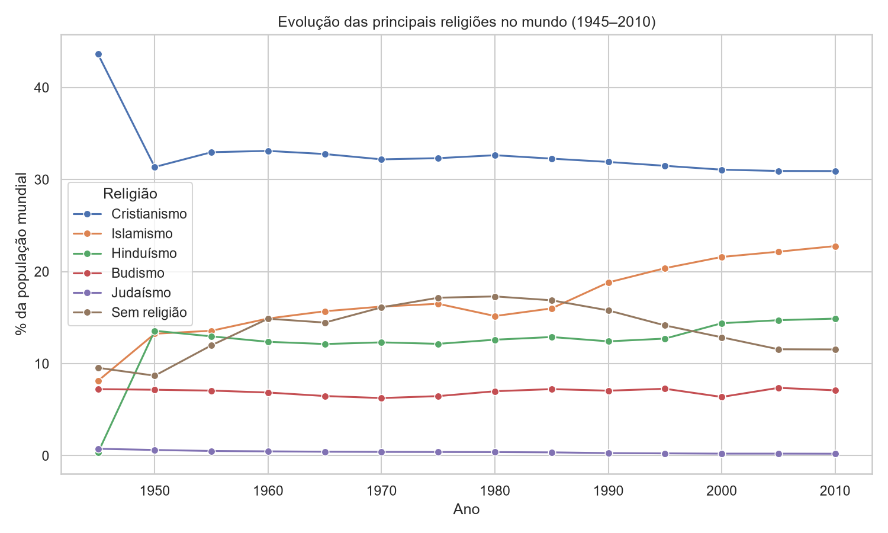

# Evolução Global das Religiões (1945–2010)

  

Análise exploratória de como a distribuição das religiões no mundo mudou entre 1945 e 2010, usando o dataset **World Religion Data** do projeto Correlates of War.



## Dados

Fonte: [World Religions – Kaggle](https://www.kaggle.com/datasets/umichigan/world-religions) (Correlates of War). Os CSVs ficam em `Dados/`, com dados de 1945 a 2010 em intervalos de 5 anos.

| Arquivo | Nível | Linhas | Colunas |
|---|---|---|---|
| `global.csv` | Mundo | 14 | 76 |
| `regional.csv` | 5 regiões | 70 | 78 |
| `national.csv` | 200 países | 1995 | 79 |

As colunas seguem o padrão `religiao_vertente` (ex.: `christianity_protestant`, `islam_sunni`). As terminadas em `_all` somam todas as vertentes e as terminadas em `_percent` são a proporção da população.

## O que o projeto faz

1. **Leitura** dos três CSVs, montando o caminho a partir da localização do código, o que permite rodar de qualquer pasta.
2. **Limpeza:**
   - tira o apóstrofo dos nomes de colunas (`islam_shi’a` → `islam_shia`);
   - remove duplicatas;
   - preenche com 0 os 5 nulos do `national.csv`.
3. **Estatística descritiva:** média, mediana, moda, desvio padrão, mínimo e máximo do percentual das principais religiões.
4. **Gráfico** de linhas em Seaborn com a evolução das religiões no mundo, salvo em `figuras/`.

## Estrutura

```
.
├── Dados/                       # CSVs do dataset
├── figuras/                     # gráficos gerados
├── src/
│   ├── Leitura/lercsv.py        # leitura dos CSVs
│   ├── Limpeza/limpeza.py       # limpar(df)
│   ├── Analise/estatistica.py   # resumo(df)
│   ├── Visualizacao/graficos.py # evolucao_global(df)
│   └── main/main.py             # roda tudo em ordem
├── requirements.txt
└── README.md
```

## Como rodar

```bash
python -m venv .venv
.venv\Scripts\activate        # Windows
# source .venv/bin/activate   # Linux/macOS
pip install -r requirements.txt
python -m src.main.main
```

Rode a partir da raiz do projeto. No PyCharm, basta executar o `main.py`.

## Observações sobre os dados

- **1945 está distorcido:** o dataset tem só 65 países nesse ano e não inclui a Índia, independente em 1947. Por isso o hinduísmo aparece com 0,3% e o cristianismo com 43,6%.
- `religion_sumpercent` passa de 100%, porque parte das pessoas é contada em mais de uma religião.
- Não some contagens de anos diferentes, porque a mesma população é contada em todos os anos.
